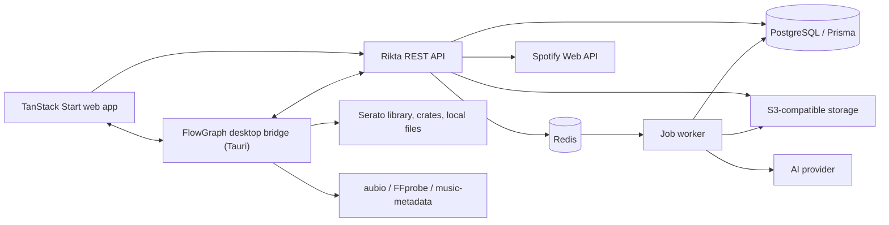

# FlowGraph DJ Planner — Merged Implementation Plan

**Status:** Implementation baseline
**Last updated:** 2 August 2026
**Supersedes:** `FLOWGRAPH_IMPLEMENTATION_PLAN.md` (product/architecture baseline) and the `ghetto-musick` prototype (to be rebuilt from scratch)
**Primary DJ platform:** Serato · **Prototype catalog source:** Spotify

---

## 0. What this merge changed

The FlowGraph plan is the product and architecture baseline and is preserved essentially intact. This merge closes open stack decisions, fills gaps the plan left unspecified, and corrects items that have shifted since it was written.

| # | Area | Plan said | Now | Why |
|---|---|---|---|---|
| 1 | Backend framework | Rikta | **`@riktajs/*` 0.12.0, exact-pinned** | Confirmed pre-1.0 with 40 weekly downloads. Kept per decision, with a hardened exit path (§6.6) |
| 2 | ORM | Prisma | **Prisma 7.9.1, hand-wired into Rikta DI** | No `@riktajs/prisma` exists; official integration is TypeORM. Wiring is ~30 lines (§6.5) |
| 3 | UI component layer | *unspecified* | **Tailwind 4.3.3 + React Aria Components 1.20** | Plan §8.6 a11y requirements are RAC's feature list verbatim |
| 4 | Graph model | *unspecified* | **graphology 0.26 in `packages/domain`** | Decouples domain from renderer; the hedge for the 1k/3k budget (§9.4) |
| 5 | Graph renderer | "React Flow or successor" | **`@xyflow/react` 12.11.2**, Sigma 3.0.3 as fallback | Names the successor; fallback swap costs no domain code |
| 6 | Auth | Open decision | **better-auth 1.6.25 + `@better-auth/prisma-adapter`** | Sessions, passkeys, magic links, and OAuth linking in one lib (§16) |
| 7 | ID strategy | Open: UUIDv7 vs CUID2 | **UUIDv7** | Plan leans on cursor pagination; CUID2 is deliberately unsortable |
| 8 | Queue | Open: BullMQ vs Rikta-native | **`@riktajs/queue` (BullMQ 6.0.5) behind a port** | Rikta's queue *is* BullMQ; port keeps the exit path open |
| 9 | Test runner | *unspecified* | **Vitest 4.1.10 + Playwright 1.62.1 + Testcontainers 12.0.4** | Plan named layers, not tools |
| 10 | Audio analysis | "Essentia/Aubio-compatible" | **Native aubio/Rust in the bridge; not essentia.js** | essentia.js is still 0.1.3 and too slow for library-scale batch |
| 11 | Tag parsing | FFprobe | **`music-metadata` 11.14 + FFprobe** | In-process tag reads avoid a sandboxed subprocess per file (§20.2) |
| 12 | Delivery | 34 weeks, 3–5 engineers | **Unchanged, plus a solo critical path** (§25.9) | Same scope solo is a multi-year project; the lane makes that explicit |
| 13 | Phase ordering | Spotify (P1) before Serato (P4) | **Optionally swap for solo build** (§25.9) | Serato is the source of truth; Spotify costs OAuth + policy machinery for weaker data |

**Dropped from the earlier stack conversation.** Drizzle, SQLite, Zero/Electric local-first sync, and Tauri-as-app-shell are all out. They were premised on a local-first single-user tool. This plan is a server-authoritative hosted app with a filesystem-only desktop bridge, which is the better architecture for the Serato requirement — the bridge reaches local files without the web app losing deployability. Prisma's expand/contract migration tooling also fits §23 better than drizzle-kit.

---

## 1. Executive summary

FlowGraph is a visual planning tool for DJs. Tracks are nodes, transitions are directed edges, and a set is a versioned path through that graph with optional branches for crowd, genre, and energy changes.

The first useful release lets a DJ:

1. Import track metadata from Spotify for rapid prototyping.
2. Import local tracks and crates from Serato through a local desktop bridge.
3. Organize tracks on an infinite graph canvas.
4. Describe and score transitions between tracks.
5. Build a linear set from the graph and inspect its energy, BPM, and key flow.
6. Add internal cue and marker suggestions without changing Serato data.
7. Export a crate and, later, approved hot cues to Serato-local files with backups and verification.
8. Ask an AI assistant to propose a set or alternate transitions from eligible metadata.

The system begins as a modular monolith plus workers, not microservices:

- TanStack Start web application.
- Rikta REST API with Zod contracts and generated OpenAPI.
- PostgreSQL through Prisma.
- Redis-backed durable jobs.
- S3-compatible object storage for user-owned analysis artifacts — not Spotify audio.
- A local desktop bridge for Serato filesystem access and local audio analysis.
- A separate worker process for AI and server-side jobs.

The major product risk is Serato interoperability. Serato cue/crate formats are not a stable public write API. Importing is read-only first; crate export precedes cue export; cue writing is beta, opt-in, backed up, format-gated, and verified before replacement.

The major *technical* risk is Rikta itself (§27). It is mitigated, not ignored.

---

## 2. Locked stack decisions

Single source of truth for versions. All verified against the npm registry on 2 August 2026. **Pin exactly — no `^` on anything pre-1.0.**

### Backend

| Package | Version | Notes |
|---|---|---|
| `@riktajs/core` | `0.12.0` | Fastify-backed, DI, autowiring, Zod-native |
| `@riktajs/swagger` | `0.12.0` | OpenAPI generation |
| `@riktajs/queue` | `0.12.0` | BullMQ-based; wrap behind a port |
| `@riktajs/cli` | `0.12.0` | Scaffold/dev/build |
| `prisma` / `@prisma/client` | `7.9.1` | Hand-wired provider; see §6.5 |
| `better-auth` | `1.6.25` | + `@better-auth/prisma-adapter` |
| `bullmq` | `6.0.5` | Transitive via `@riktajs/queue`; direct if the port needs it |
| `zod` | `4.4.3` | Contracts, everywhere |
| Node | `22 LTS` | Rikta `engines: >=20` |

Not adopted: `@riktajs/typeorm` (using Prisma), `@riktajs/passport` (using better-auth), `@riktajs/ssr` + `@riktajs/react` (web is TanStack Start; do not run two SSR stacks).

### Frontend

| Package | Version | Notes |
|---|---|---|
| `@tanstack/react-start` | `1.168.34` | Router `1.170.18` |
| `@tanstack/react-query` | `5.101.4` | Server state |
| `tailwindcss` | `4.3.3` | CSS-first config |
| `react-aria-components` | `1.20.0` | Component layer — own the components |
| `@xyflow/react` | `12.11.2` | Canvas renderer |
| `graphology` | `0.26.0` | Graph model, renderer-agnostic |
| `sigma` | `3.0.3` | WebGL fallback renderer, only if §9.4 gate fails |
| `zustand` | `5.0.14` | Ephemeral canvas interaction state only |

### Bridge and analysis

| Package | Version | Notes |
|---|---|---|
| `@tauri-apps/api` / `cli` | `2.11.1` / `2.11.4` | Desktop bridge |
| `music-metadata` | `11.14.0` | In-process tag parsing |
| `wavesurfer.js` | `7.12.11` | Waveform rendering (peaks from bridge) |
| aubio / Rust DSP | native | BPM/key/onset — **not** essentia.js (still `0.1.3`) |
| FFprobe | system | Media properties, format validation |

### Quality

| Package | Version |
|---|---|
| `vitest` | `4.1.10` |
| `@playwright/test` | `1.62.1` |
| `testcontainers` / `@testcontainers/postgresql` | `12.0.4` |

---

## 3. Product goals, users, and scope

### 3.1 Goals

- Make non-linear DJ planning faster than working with playlists alone.
- Preserve multiple valid next-track choices instead of forcing a single sequence.
- Make transition knowledge reusable: cues, bars, technique, stems, and performance notes live on edges and markers.
- Turn a graph path into a practical Serato crate and performance cue sheet.
- Use AI to accelerate selection and explanation while keeping the DJ in control.
- Treat Serato/local files as the durable DJ source of truth and Spotify as discovery/bootstrap metadata.

### 3.2 Primary users

Open-format DJs needing crowd-response branches · house/techno DJs planning harmonic and energy arcs · wedding/event DJs needing dependable fallback paths · producer/DJs planning stem overlays, loops, and mashups.

### 3.3 MVP in scope

Single-user workspaces with secure authentication · Spotify connection, playlist browsing, metadata import · Serato bridge proof of concept (library/crate scan, local-file matching) · track library, filters, graph positions, transition edges, linear sets · internal cues/markers and transition recipes · deterministic transition scoring and set validation · AI-generated set preview with explicit confirmation before persistence · job status, retry, audit trail, OpenAPI docs, CI, staging, backups.

### 3.4 Explicitly out of scope for MVP

Full audio playback or download of Spotify content · live deck control or replacing Serato during performance · automatic writing to original audio files · stems generation at scale · collaborative editing, public sharing, marketplace, billing, mobile-native apps · other DJ applications · training or fine-tuning models on Spotify content.

### 3.5 Success measures

- Account creation to first imported 20-track graph: **under 10 minutes**.
- Create/reorder a 10-track set with no lost edits: **under 5 minutes**.
- Graph interactions responsive at **1,000 nodes / 3,000 edges** on a reference laptop.
- **≥95%** of imported Serato files deterministically matched or clearly presented for manual resolution.
- **No source-file mutation** in all pre-cue-export releases.
- AI preview schema-valid rate **≥99%** after one automatic repair attempt.
- Set-generation acceptance rate and edited-track count are measured, not assumed.

---

## 4. Principles and source-of-truth rules

1. **The graph is the planning model.** A set references graph tracks and transitions; it does not duplicate canonical metadata.
2. **Sets are versioned snapshots.** A later track edit must not silently alter the historical plan used at a gig.
3. **Serato/local files win for DJ metadata.** BPM, key, cues, beatgrids, and file identity from the current local file are authoritative unless the user overrides them.
4. **Spotify is an external catalog identity.** Permitted metadata and links only — never downloadable audio, stems, or writable cues.
5. **User edits beat automation.** Every derived field records provenance and confidence; manual values are never overwritten without confirmation.
6. **AI proposes; deterministic code validates.** The model never writes files or directly commits a generated set.
7. **Destructive operations are two-phase.** Preview/diff, then explicit approval, then backup, write, read-back verification, and audit.
8. **Offline degradation is deliberate.** Graph and saved sets remain usable if Spotify, AI, or the bridge is unavailable.
9. **The framework is replaceable.** No business logic may depend on Rikta types. See §6.6.

### 4.1 Field precedence

For BPM, key, duration, cues, and beatgrid data:

`manual override > verified Serato/local analysis > imported Serato metadata > local analysis suggestion > Spotify catalog metadata > AI suggestion`

Each resolved field retains the winning value plus source, source timestamp, confidence, and optional original value.

---

## 5. Architecture

### 5.1 Logical components



### 5.2 Deployable units

| Unit | Responsibility | Scaling |
|---|---|---|
| `web` | TanStack Start UI, SSR where useful | Horizontal/stateless |
| `api` | Rikta controllers, auth, domain services, OpenAPI | Horizontal/stateless |
| `worker` | AI, imports, analysis orchestration, exports | Scale by queue depth |
| `desktop-bridge` | User-authorized Serato/local filesystem operations | Runs on the DJ's computer |
| PostgreSQL | Durable relational state | Managed, PITR enabled |
| Redis | Queue, short-lived locks, rate-limit counters | Managed |
| Object storage | Waveform peaks, analysis results, export bundles | Versioning + lifecycle |

### 5.3 Why REST/OpenAPI

Rikta is built on Fastify with DI, auto-discovery, and native Zod validation; `@riktajs/swagger` maps cleanly to an OpenAPI-first client workflow. REST gives simple job endpoints, conditional requests, upload handshakes, and bridge compatibility. GraphQL and tRPC add little to the first release.

The OpenAPI document is a checked-in build artifact. Generate a typed client for web and bridge. Never hand-maintain duplicate request types.

### 5.4 Repository layout

```text
apps/
  api/                    # Rikta application
  worker/                 # queue processors
  web/                    # TanStack Start frontend
  desktop-bridge/         # Tauri desktop agent
packages/
  contracts/              # Zod schemas, API error model, domain enums
  db/                     # Prisma schema/client/migrations
  domain/                 # pure graph (graphology), harmonic, scoring, set logic
  api-client/             # generated OpenAPI client
  ui/                     # Tailwind preset + React Aria component primitives
  observability/          # logging, traces, metrics helpers
  test-factories/         # fixtures/builders
infra/
  docker/ terraform/ environments/
docs/
  adr/ runbooks/
```

pnpm workspaces. Turborepo only if it reduces repeated build/test work; never depend on Turborepo cloud services.

---

## 6. Backend structure with Rikta

### 6.1 Module boundaries

Rikta auto-discovers providers and controllers; keep explicit domain boundaries anyway:

```text
src/
  bootstrap.ts
  config/
  common/  auth/ errors/ idempotency/ pagination/ telemetry/
  tracks/ graphs/ transitions/ sets/ markers/
  integrations/  spotify/ serato/
  ai/ jobs/ storage/ exports/ feature-flags/ health/
```

Each feature owns its controller, service, repository functions, Zod schemas, authorization policy, and tests. Controllers stay thin. Business rules live in `packages/domain` or in services that accept plain interfaces. Prisma appears only at repository boundaries.

### 6.2 Request lifecycle

1. Correlation ID and structured request context.
2. Authentication and session validation.
3. Workspace authorization.
4. Zod validation/coercion.
5. Idempotency check for supported mutations.
6. Domain operation in a Prisma transaction where needed.
7. Audit event and outbox event written in the same transaction.
8. Consistent response envelope and OpenAPI-described errors.

### 6.3 API conventions

- Base path `/v1`. JSON camelCase.
- **IDs are UUIDv7** (decision closed — see §31).
- Cursor pagination for tracks, jobs, imports, audit events.
- `ETag`/`If-Match` or integer `version` for graph layout and set mutations.
- `Idempotency-Key` for imports, exports, AI generation, batch mutations.
- RFC 9457 problem details for errors.
- `202 Accepted` with a job resource for long-running work.
- Batch endpoints bounded and either transactional or reporting per-item results explicitly.

### 6.4 Why UUIDv7 over CUID2

The plan uses cursor pagination pervasively (§6.3) and inserts high-volume rows (`ImportItem`, `AuditEvent`, `GraphNode`). UUIDv7 is time-ordered, which gives sequential B-tree insert locality in Postgres and makes IDs usable as a natural cursor tiebreak. CUID2 is *deliberately* non-sortable — an anti-goal here. Postgres 18 ships native `uuidv7()`; generate application-side for portability.

### 6.5 Wiring Prisma into Rikta

There is no `@riktajs/prisma`. This is not a blocker — Prisma Client is framework-agnostic. Register it as a DI singleton and bind lifecycle to Rikta's Fastify hooks:

- Instantiate `PrismaClient` once in a provider module.
- `$connect()` on app ready; `$disconnect()` on close, before Fastify finishes draining.
- Expose it only to repository classes, never to controllers.
- Add `@prisma/instrumentation` (7.9.1) to the OpenTelemetry setup in `packages/observability`.

Budget roughly 30 lines plus a test asserting connect/disconnect ordering under graceful shutdown. **Do not adopt `@riktajs/typeorm`** — running two ORMs is worse than hand-wiring one.

### 6.6 Rikta containment and exit path

`@riktajs/core` is `0.12.0`, first published 2025-12-19, with 39 releases and ~40 weekly downloads. That is a young framework with real breaking-change velocity and a thin support surface. It is the chosen framework; these rules keep the choice cheap to reverse.

**Verified behaviour** (established empirically against `0.12.0`, recorded in `docs/adr/0002-rikta.md`):

- `@riktajs/core` hard-depends on `zod@4.3.5` and `fastify@5.3.2` as *direct*, not peer, dependencies — an install contains two copies of each. **Cross-instance Zod schemas still validate correctly** (Rikta duck-types via `.safeParse()`, not `instanceof`), so rule 4 below is safe.
- **Default error responses include full stack traces** with absolute filesystem paths. Must be disabled outside development.
- **Property-based `@Autowired()` requires `emitDecoratorMetadata`** and fails under esbuild/tsx. Explicit tokens work with any transpiler.
- Request handling runs through Rikta's **bundled** Fastify, not any app-level Fastify.

**Containment rules — enforced in CI:**

1. **Exact-pin every `@riktajs/*` package.** No `^`, no `~`. A 0.x minor is a potential breaking change.
2. **No Rikta import outside `apps/api/src/**/*.controller.ts` and `bootstrap.ts`.** Add an ESLint `no-restricted-imports` rule with those paths as the only allowlist. This is the single most important rule in the document.
3. **Services accept plain interfaces**, never Rikta request/reply types. Controllers translate.
4. **All Zod schemas live in `packages/contracts`**, not inline in Rikta decorators, so validation survives a framework swap.
5. **Prefer explicit DI tokens** — `@Autowired(Token)` over bare `@Autowired()` — removing the `emitDecoratorMetadata` dependency.
6. **Disable stack traces in non-development error responses**, configured in `bootstrap.ts`.
7. **Do not pin Fastify at the app level** for the API; it has no effect. Depend on what Rikta bundles.
8. **Queue access goes through a port** (`JobQueue` interface) implemented by `@riktajs/queue`. BullMQ 6.0.5 is the fallback implementation.
9. **Pin the Rikta version bump to its own PR** with the full integration suite green. Never bundle it with feature work.

**Exit path.** Because Rikta is Fastify-backed, the fallback is plain Fastify 5.11 plus a minimal DI container (or `awilix`). With rules 2–4 held, the migration touches controllers and `bootstrap.ts` only — a bounded, days-not-weeks change. Write this down as `docs/adr/0002-rikta.md` at Phase 0, including the trigger conditions: an unpatched security issue, a stalled release cadence beyond 90 days, or a breaking change that costs more than one sprint to absorb.

---

## 7. Domain model

### 7.1 Core aggregates

**Identity and tenancy** — `User`, `Workspace`, `WorkspaceMember`, `Session`, `ConnectedAccount` (encrypted OAuth credentials).

**Track library** — `Track` (canonical identity + normalized display metadata), `TrackSource` (provider identity), `LocalFile` (path fingerprint, size, timestamps, content fingerprint, media properties, bridge device), structured provenance fields, `Tag`/`TrackTag`, `AudioAnalysis` (versioned analyzer output + confidence), `WaveformAsset` (peaks, not raw audio), `StemAsset` (future, licensed audio only).

**Planning graph** — `Graph`, `GraphNode` (track ref + position, dimensions, collapsed state, color, version), `Transition` (directed reusable relationship), `TransitionCueBinding`, `GraphViewport`.

**Cues and markers** — `Marker` (provider-neutral timestamp/beat position with type, label, color, source, confidence, approval state), `SavedLoop`, `MarkerRevision`, `SeratoCueMapping`.

**Sets** — `Set`, `SetVersion` (immutable snapshot on publish/export), `SetItem`, `SetItemTransition`, `SetBranch`, `SetBranchItem`, `SetConstraint`.

**Operations** — `ImportRun`/`ImportItem`/`MatchCandidate`, `ExportRun`/`ExportItem`/`BackupArtifact`, `Job`, `AiGeneration`/`AiSuggestion`/`SuggestionFeedback`, `FeatureFlag`/`FeatureFlagOverride`, `AuditEvent`, `OutboxEvent`.

### 7.2 Important modelling choices

- Graph position lives on `GraphNode`, never `Track` — the same track appears in multiple graphs.
- Do **not** store `bpmFrom`/`bpmTo`/`keyFrom`/`keyTo` as authoritative transition fields. Compute from the chosen metadata snapshot; store a score snapshot on published `SetVersion` if history matters.
- Transitions are **directed**. A→B is not automatically valid as B→A.
- A marker belongs to a track, not a graph node.
- Store positions in milliseconds **and**, when a beatgrid exists, musical position `{bar, beat, fraction}`. Milliseconds alone drift after grid edits.
- Use `Decimal` for BPM and scores, not binary floats, where exact comparison matters.
- Store external tokens encrypted, separate from general account metadata.
- Persist AI input policy classification and model/version; redact secrets; retain no prohibited provider content.

### 7.3 Prisma schema outline

```prisma
model Workspace           { /* id, name, timestamps, members */ }
model User                { /* id, email, displayName, sessions */ }
model WorkspaceMember     { /* workspaceId, userId, role */ }
model Session             { /* managed by better-auth adapter */ }
model ConnectedAccount    { /* provider, encrypted tokens, scopes, expiry */ }

model Track               { /* canonical metadata, provenance, optimistic version */ }
model TrackSource         { /* provider, externalId/URI, rawMetadata, sync state */ }
model LocalFile           { /* deviceId, canonical path, fingerprints, media info */ }
model Tag                 { /* workspace-scoped name/color */ }
model TrackTag            { /* trackId, tagId */ }
model AudioAnalysis       { /* analyzer/version/results/confidence */ }
model WaveformAsset       { /* object key, format/version */ }

model Graph               { /* workspaceId, name, version */ }
model GraphNode           { /* graphId, trackId, x, y, width, height */ }
model GraphViewport       { /* graphId, userId, x, y, zoom */ }
model Transition          { /* fromTrackId, toTrackId, technique, notes */ }
model TransitionCueBinding{ /* transitionId, markerId, role */ }

model Marker              { /* trackId, type, ms, beat position, provenance */ }
model MarkerRevision      { /* marker snapshot + actor */ }
model SavedLoop           { /* trackId, start, lengthBeats, slot */ }
model SeratoCueMapping    { /* markerId, localFileId, slot, sync fingerprint */ }

model Set                 { /* workspaceId, name, draft state, version */ }
model SetItem             { /* setId, trackId, rank, notes */ }
model SetItemTransition   { /* fromItemId, toItemId, transitionId */ }
model SetBranch           { /* setId, entryItemId, rejoinItemId, label */ }
model SetBranchItem       { /* branchId, trackId, rank */ }
model SetVersion          { /* immutable JSON snapshot/hash */ }

model ImportRun           { /* source, status, checkpoint, summary */ }
model ImportItem          { /* source identity, outcome, error */ }
model ExportRun           { /* type, status, bridge device, approval */ }
model ExportItem          { /* local file, diff, result, backup */ }
model AiGeneration        { /* kind, model, prompt policy, result, status */ }
model SuggestionFeedback  { /* accepted/rejected/edited */ }
model AuditEvent          { /* actor, action, target, redacted details */ }
model OutboxEvent         { /* topic, payload, publishedAt */ }
```

`Session` and account linkage are owned by `@better-auth/prisma-adapter`; generate its models into the same schema rather than hand-authoring them (§16).

### 7.4 Constraints and indexes

- Unique `WorkspaceMember(workspaceId, userId)`.
- Unique `TrackSource(workspaceId, provider, externalId)` where external ID is non-null.
- Unique `LocalFile(deviceId, canonicalPathHash)`; separate index on audio fingerprint.
- Unique `GraphNode(graphId, trackId)` for MVP unless duplicate visual occurrences are required.
- Unique `Transition(workspaceId, fromTrackId, toTrackId, technique)` with soft-delete filtering.
- Unique marker slot mapping per `(localFileId, slot)`.
- Ordered set items use **fractional/ranked strings**, not renumbered integers.
- Check constraints: BPM > 0, energy within scale, marker time ≥ 0, graph zoom within bounds.
- Full-text/trigram indexes on title, artist, album; indexes for workspace+BPM, key, energy, provider.
- Partial indexes for active jobs, unmatched import items, non-deleted records.

---

## 8. REST API design

All endpoints are workspace-scoped by authenticated context; clients never choose an unrestricted owner ID.

### 8.1 Auth and account

```text
POST   /v1/auth/login
POST   /v1/auth/logout
POST   /v1/auth/refresh
GET    /v1/me
GET    /v1/connected-accounts
DELETE /v1/connected-accounts/:provider
```

### 8.2 Tracks and metadata

```text
GET    /v1/tracks?query=&cursor=&bpmMin=&bpmMax=&key=&tag=&source=
POST   /v1/tracks
GET    /v1/tracks/:trackId
PATCH  /v1/tracks/:trackId
DELETE /v1/tracks/:trackId              # soft delete; warn on references
POST   /v1/tracks/merge                 # preview then confirm duplicate merge
GET    /v1/tracks/:trackId/provenance
GET    /v1/tracks/:trackId/analysis
```

### 8.3 Graphs and transitions

```text
GET    /v1/graphs
POST   /v1/graphs
GET    /v1/graphs/:graphId
PATCH  /v1/graphs/:graphId
POST   /v1/graphs/:graphId/nodes:batch
PATCH  /v1/graphs/:graphId/layout       # bounded batch + version/If-Match
DELETE /v1/graphs/:graphId/nodes/:nodeId

GET    /v1/transitions?fromTrackId=&toTrackId=
POST   /v1/transitions
GET    /v1/transitions/:transitionId
PATCH  /v1/transitions/:transitionId
DELETE /v1/transitions/:transitionId
POST   /v1/transitions/:transitionId/score
```

### 8.4 Markers and loops

```text
GET    /v1/tracks/:trackId/markers
POST   /v1/tracks/:trackId/markers
PATCH  /v1/markers/:markerId
DELETE /v1/markers/:markerId
POST   /v1/tracks/:trackId/markers:suggest
POST   /v1/tracks/:trackId/markers:batch-approve
GET    /v1/markers/:markerId/revisions
```

### 8.5 Sets and branches

```text
GET    /v1/sets
POST   /v1/sets
GET    /v1/sets/:setId
PATCH  /v1/sets/:setId
DELETE /v1/sets/:setId
POST   /v1/sets/:setId/items
PATCH  /v1/sets/:setId/items:reorder
DELETE /v1/sets/:setId/items/:itemId
POST   /v1/sets/:setId/branches
PATCH  /v1/sets/:setId/branches/:branchId
POST   /v1/sets/:setId/validate
POST   /v1/sets/:setId/publish
GET    /v1/sets/:setId/versions
```

### 8.6 Spotify

```text
GET    /v1/integrations/spotify/authorize
GET    /v1/integrations/spotify/callback
GET    /v1/integrations/spotify/playlists
GET    /v1/integrations/spotify/playlists/:playlistId/items
GET    /v1/integrations/spotify/search?q=
POST   /v1/imports/spotify-playlist
POST   /v1/imports/spotify-tracks
```

### 8.7 Serato bridge

```text
POST   /v1/bridge/devices/register
POST   /v1/bridge/devices/:deviceId/heartbeat
POST   /v1/imports/serato-scan
POST   /v1/imports/:importId/checkpoint
POST   /v1/imports/:importId/items:batch
GET    /v1/imports/:importId/matches
POST   /v1/imports/:importId/matches:resolve
POST   /v1/exports/serato-crate
POST   /v1/exports/serato-cues/preview
POST   /v1/exports/serato-cues/:exportId/approve
POST   /v1/exports/:exportId/results
```

### 8.8 AI and jobs

```text
POST   /v1/ai/set-generations
POST   /v1/ai/transition-suggestions
GET    /v1/ai/generations/:generationId
POST   /v1/ai/generations/:generationId/accept
POST   /v1/ai/suggestions/:suggestionId/feedback

GET    /v1/jobs/:jobId
POST   /v1/jobs/:jobId/cancel
POST   /v1/jobs/:jobId/retry
GET    /v1/jobs/:jobId/events            # SSE optional
```

### 8.9 Contract quality gates

- Every public operation has a Zod request schema, response schema, examples, auth declaration, and documented error cases.
- OpenAPI generation fails CI on duplicate operation IDs or undocumented response bodies.
- A generated-client diff is required in the same change as an API contract change.
- Consumer contract tests run against a booted API in CI.

---

## 9. Frontend application plan

### 9.1 Stack

- **TanStack Start 1.168** — routing, SSR where beneficial, loaders/actions, deployment flexibility.
- **TanStack Query 5.101** — server state, caching, retries, optimistic mutations.
- **Tailwind 4.3 + React Aria Components 1.20** — component layer (§9.2).
- **graphology 0.26** — the graph model (§9.3).
- **`@xyflow/react` 12.11** — canvas renderer.
- **Zustand 5.0** — ephemeral canvas interaction state only; server state stays in TanStack Query.
- Generated OpenAPI client for all API access.
- Web Workers for heavy layout/graph calculations.
- IndexedDB for drafts/offline buffering **only after** conflict semantics are defined.

### 9.2 Why React Aria Components

The plan's §9.6 accessibility requirements — full keyboard creation, selection, connection, deletion, and reordering; screen-reader descriptions for nodes, edges, and set ordering; reduced-motion support; minimum target sizes and clear focus states — are effectively RAC's feature list. Its drag-and-drop implementation in particular ships keyboard and screen-reader affordances that are extremely expensive to retrofit, and the library track (set timeline reorder, library→graph drag) is DnD-heavy.

Build primitives in `packages/ui` on RAC + a shared Tailwind preset. Do not adopt a batteries-included component library: it will fight the canvas and duplicate the a11y runtime. Base UI was evaluated and rejected — still `1.0.0-rc.0`.

### 9.3 Why graphology owns the graph

Keep the authoritative graph in a `graphology` instance inside `packages/domain`, not in React Flow's node/edge arrays. React Flow renders a *projection* of it.

This buys three things:

1. **Path-finding, filtering, harmonic scoring, and set validation become pure functions** over a real graph structure — unit-testable with no DOM, which is exactly what §21's unit layer demands.
2. **It kills the state-duplication bug class.** The prototype stored connection tags in both a `musicConnections` array and inside `edges[].data`, hand-syncing them on every mutation. A single graph instance makes that structurally impossible.
3. **It is the escape hatch for §9.4.** If the 1k/3k budget fails, swap the renderer to Sigma 3.0.3 without touching a line of domain code.

### 9.4 The 1k/3k performance gate

§3.5 requires 1,000 nodes and 3,000 edges to stay responsive. `@xyflow/react` renders DOM nodes and this is precisely where that degrades. Treat it as an explicit gate, not an assumption.

Build the performance harness in **Phase 2, before the inspector UI is polished**. Mitigations in order:

1. Simplified node rendering below a zoom threshold (plan §9.5).
2. Viewport culling of off-screen nodes.
3. Move auto-layout and path scoring to a Web Worker.
4. **If still failing: swap to Sigma 3.0.3.** Cost is a renderer rewrite, roughly one to two weeks, with zero domain changes — but only if §9.3 was respected.

Record the measured result in an ADR either way.

### 9.5 Primary routes

```text
/onboarding  /library  /graphs/:graphId  /sets  /sets/:setId
/ai  /settings/integrations  /settings/serato  /jobs/:jobId
```

### 9.6 Main shell

- **Top bar** — workspace, graph/set switcher, undo/redo, sync status, job center, profile.
- **Left panel** — library search, filters, saved views, crates, Spotify playlists, drag source.
- **Center** — infinite graph canvas.
- **Right inspector** — Track, Transition, Set, and AI tabs based on selection.
- **Bottom drawer** — set timeline, branches, energy/BPM/key overlays, validation issues.
- **Command palette** — search, add to set, create transition, focus selected, generate alternatives.

### 9.7 Frontend modules

`auth` · `library` (virtualized rows, filters, bulk selection, source badges) · `graph` (nodes, typed handles, edges, selection, viewport, layout) · `inspector` (provenance, markers, transition recipe, conflicts) · `sets` (timeline, branches, publishing, versions, validation) · `ai` · `integrations` · `jobs` · `feature-flags`.

### 9.8 UI performance requirements

Virtualize library rows · simplified nodes below zoom threshold · defer marker/stem detail until inspected · debounce graph position writes and send a bounded batch on pointer release · keep drag state local with optimistic updates and server version checks · auto-layout and large-path scoring off the main thread · viewport-chunked graph loading only if profiling demands it.

### 9.9 Accessibility and interaction

Full keyboard creation, selection, connection, deletion, reordering · never encode transition type or energy by color alone · screen-reader descriptions for selected nodes/edges and set ordering · respect reduced motion, expose zoom controls · minimum target sizes and clear focus states · undo/redo for graph and set edits · destructive actions confirm when referenced.

---

## 10. Graph and set behavior

### 10.1 Graph interactions

Drag a track from the library to create a node · drag from an output handle to a target to begin transition creation · quick-create uses a default recipe and deterministic score, refined in the inspector · multi-select supports move, tag, add to set, and **delete-from-graph, not delete-from-library** · edge color/dash/icon represents technique and compatibility · auto-layout modes: freeform, BPM lane, energy lane, genre cluster, selected-set path · filters **dim** non-matching nodes rather than removing context · changes are optimistic and versioned, with conflict resolution offering reload or reapply.

### 10.2 Transition recipe

A transition includes from/to identity and direction; technique (blend, long blend, cut, echo out, filter sweep, loop build, acapella over, genre flip, custom); mix-out and mix-in markers; planned bars, tempo target, optional key shift, stem usage, FX notes, freeform notes; deterministic component scores for tempo, harmonic, energy, phrase/cue availability, genre/style, and user-history signal; overall score and explanation snapshot with algorithm version.

Scores are advisory. A deliberate clash or energy jump is valid when explicitly marked intentional.

### 10.3 Harmonic scoring module

Lives in `packages/domain`, pure, zero dependencies beyond graphology. Maps key signatures to the Camelot wheel and scores compatibility: same code, ±1 on the wheel, and relative major/minor swaps rank highest; everything else degrades by distance. Combined with a BPM-delta window (default ±6%, configurable) and shared-tag overlap, this produces the deterministic transition score of §10.2 and the candidate features of §14.3.

This is the product's core intelligence and it is roughly 200 lines of pure TypeScript. It must be exhaustively unit-tested and algorithm-versioned — every stored score records the version that produced it.

### 10.4 Set model and behavior

A draft set is an ordered list of track occurrences linked by chosen transitions · dragging a graph node into the timeline creates a set item without moving the node · adjacent tracks use an existing transition when one matches, otherwise show a missing-transition state · reordering recalculates adjacency and flags detached transition choices · branches have an entry item and optional rejoin item (MVP UI may support one level) · timeline overlays show elapsed time, energy curve, BPM, Camelot key, genre, warnings · publishing creates an immutable `SetVersion` used for exports and performance view.

### 10.5 Deterministic set validation

Before publish/export, validate: missing or unavailable local files · duplicate tracks within a configurable window · missing transition recipe between adjacent items · BPM movement beyond limits · harmonic compatibility warnings (not hard failures) · duration tolerance · energy-curve violations · unapproved AI markers used in an export · Serato slot conflicts or unsupported file types · branches that cannot reach a terminal/rejoin point.

---

## 11. Cue, marker, and loop handling

### 11.1 Internal marker types

Hot cue · mix in · mix out · intro start/end · breakdown · drop · vocal start/end · phrase boundary · memory/note marker · saved loop.

Internal semantics are richer than Serato slots. Export maps a selected subset to Serato-compatible hot cues and loops.

### 11.2 Marker lifecycle

1. Imported, manually created, analysis-suggested, or AI-suggested.
2. Stored with source, confidence, analyzer/model version, approval state.
3. Edited or approved by user.
4. Bound to a transition role if used in a recipe.
5. Included in a Serato export preview only if approved.
6. Assigned to an available Serato slot or explicitly replacing an existing one.
7. Written by the bridge, read back, verified, marked synchronized.

### 11.3 Conflict handling

Never silently overwrite a Serato cue · preview existing vs proposed slots, timestamps, labels, colors · let the user skip, choose another slot, or replace · detect file changes after preview via fingerprint and require a refreshed preview · keep a backup manifest and original copy · treat a partial batch as failed per item, never claim whole-export success.

---

## 12. Serato integration strategy

### 12.1 Architectural requirement: desktop bridge

A hosted service cannot access arbitrary local Serato files. Build a signed Tauri 2.11 bridge the user explicitly installs and authorizes. It exposes no general remote filesystem API.

Responsibilities: discover configured Serato roots and crates · parse library/crate metadata read-only · fingerprint local files and send normalized manifests, not audio · run local audio analysis · produce crate/export files into an explicit staging directory · later, apply approved cue changes with backup and verification.

### 12.2 Bridge security model

Device enrollment via short-lived one-time code from the authenticated web app · scoped credential in OS secure storage · signed, short-lived, idempotent commands restricted to registered roots · outbound TLS only, no inbound LAN port · every filesystem action is a previewable command with an audited result · signed auto-update packages with rollback · logs redact usernames, full paths, tokens, and track metadata unless diagnostics are explicitly exported.

### 12.3 Delivery phases

**S0 — format spike.** Disposable corpus of Serato libraries and audio formats · document crate/library/cue behavior across macOS and Windows versions in an ADR · determine supported formats and the non-destructive verification approach · **stop the feature if reliable backup/restore and read-back cannot be demonstrated.**

**S1 — read-only import.** Scan crates and tracks · import path, file stats, tags, BPM/key, existing cues where reliably readable · match by provider ID/ISRC, then audio fingerprint, then normalized metadata+duration · present ambiguous matches for manual resolution.

**S2 — crate export.** Export a published set as a new or staged crate · never overwrite an existing crate by default · validate all local paths and produce a missing-file report.

**S3 — cue export beta.** Only explicitly tested file/container/version combinations · generate diff, obtain approval, backup, write to staged copy, read back, verify, then atomically replace where safe · behind device- and workspace-level flags with a kill switch.

### 12.4 Acceptance gates

Read-only import cannot mutate fixtures (byte-for-byte verification) · re-import is idempotent · crate export opens correctly across the supported Serato/OS matrix · cue export round-trips all supported slots, labels, colors, timestamps within tolerance · failure injection at every write step leaves originals recoverable · a documented restore action exists in the bridge UI.

---

## 13. Spotify integration

### 13.1 Purpose and boundaries

Spotify accelerates prototype onboarding via search, saved-library metadata, and playlist import. It is **not** a source for audio files, stems, writable cues, or guaranteed DJ analysis fields.

Authorization Code flow server-side for the hosted app; PKCE if auth is ever initiated from a public client. Request only needed scopes — initially playlist/library read. Add modification scopes only when an explicit export-to-Spotify feature exists.

### 13.2 Imported fields

Spotify track ID/URI and link · name, artists, album, artwork URL, duration, explicit flag, availability, ISRC when supplied · playlist membership and order · import timestamp and raw response version needed for reconciliation.

Honor attribution, linking, artwork presentation, retention, and deletion requirements. Never download Spotify content. Preview URLs are not durable playback assets.

### 13.3 Token handling

Envelope-encrypt access and refresh tokens via KMS · store granted scopes and expiry · refresh server-side under a per-account distributed lock · revoke and delete on user request · handle 401, 403, 429, relinked tracks, removed items, market restrictions, revoked access.

### 13.4 Import behavior

1. Create `ImportRun` with playlist snapshot reference and idempotency key.
2. Page through playlist item endpoints honoring rate limits.
3. Normalize and upsert `TrackSource`.
4. Match existing `Track` by Spotify identity, then ISRC, then safe metadata heuristics.
5. Create unresolved items below the confidence threshold.
6. Save playlist order as an imported collection, **not** automatically as a published set.
7. Report imported, updated, skipped, unavailable, failed counts.

### 13.5 AI policy boundary

Spotify developer policies restrict using Spotify content to train or ingest into AI models. Maintain a policy gate excluding Spotify-origin raw metadata, artwork, previews, and provider payloads from AI prompts and training pipelines unless current written terms and legal review explicitly permit a narrow use. AI operates on user-authored tags/constraints, local-file analysis, and FlowGraph-owned metadata. Spotify imports stay useful without AI depending on them.

---

## 14. AI set generation and transition suggestions

### 14.1 Capabilities

Generate a linear set preview from duration, context, genres, BPM range, start/end energy, exclusions, anchor tracks, optional branch descriptions · suggest several next tracks from a selected track · suggest a transition technique and relevant markers · explain tradeoffs and constraint violations · offer alternate paths rather than one "correct" answer.

### 14.2 Hybrid pipeline

```text
User request
→ Zod validation and policy classification
→ deterministic candidate filtering
→ feature calculation and graph search (graphology + §10.3)
→ LLM selection/reasoning over an eligible bounded candidate set
→ strict structured output validation
→ deterministic re-scoring and constraint checks
→ preview with warnings
→ user edits/accepts
→ transactional persistence
```

Algorithms do math and constraints. The model does interpretation, selection among viable candidates, naming, explanation, and creative branching.

### 14.3 Candidate features

BPM delta and feasible pitch range · Camelot/harmonic relationship (§10.3) · energy delta vs requested curve · genre/tag compatibility · duration and phrase/cue availability · existing user-authored transition confidence · duplicate/recent-use penalty · local availability and source eligibility · explicit exclusions and anchors.

### 14.4 Output contract

The model returns IDs **only** from the supplied eligible candidate set, plus set name and rationale, ordered track IDs, transition technique per adjacent pair, marker roles using existing marker IDs or suggestion placeholders, constraint report, optional branch paths, and per-choice explanation and uncertainty.

Reject unknown IDs, invalid adjacency, impossible duration, and schema failures. One repair attempt is allowed; then fail clearly without persisting a partial set.

### 14.5 Prompt and model governance

Version system prompts, schemas, scoring weights, model configuration · record token/cost/latency, validation outcome, redacted policy-safe input hash · pin model versions in production and evaluate before upgrades · defend against prompt injection by treating all imported metadata as untrusted data fields · never pass secrets, local paths, raw audio, Spotify provider payloads, or unnecessary personal data · apply per-user quotas and request-size/candidate-count limits.

### 14.6 Evaluation

Fixed, rights-safe evaluation library with expected constraints and expert-rated alternatives. Measure schema validity, constraint adherence, harmonic/BPM warning rate, track diversity, unsupported-ID rate, latency, cost, user acceptance, edit distance, rejection reasons. Release model changes only against regression thresholds. AI quality is evaluated separately from deterministic transition-score quality.

---

## 15. Storage and audio analysis

### 15.1 Object storage policy

Store only waveform peak arrays, analyzer JSON results, approved export bundles and backups with short retention, user-uploaded artwork, and — in future — stems for user-owned/licensed audio with explicit consent.

Raw local audio stays on the user's device by default. Spotify audio is never stored.

### 15.2 Local-first analysis

Run heavyweight, file-sensitive analysis in the bridge:

- **Media properties and format validation** — FFprobe.
- **Tag parsing** — `music-metadata` 11.14, in-process. Prefer it over spawning FFprobe per file: §20.2 requires sandboxing analysis subprocesses with time and resource limits, and every subprocess avoided is one less sandbox to manage across a multi-thousand-file scan.
- **Waveform peaks, loudness, BPM/key estimates, onset/beat/phrase candidates** — a versioned native analyzer. **Use native aubio or Rust DSP crates, not essentia.js**, which is still `0.1.3` and far too slow for library-scale batch analysis in WASM. Analyzer selection, licensing, and binary distribution is decision §31-7.
- **Optional audio fingerprint** for matching.

Upload compact results and hashes, never raw audio. Record analyzer name, version, parameters, confidence, source-file fingerprint, and timestamp. Invalidate results when the file fingerprint changes.

### 15.3 Server-side analysis option

Add opt-in server analysis only if users need cross-device processing. Presigned upload URLs, malware/media validation, strict file limits, tenant-scoped object keys, encryption, short raw-audio retention, deletion workflows. Confirm rights and product policy before stems or derivative audio processing.

---

## 16. Authentication and authorization

### 16.1 Approach: better-auth

Use **better-auth 1.6.25** with `@better-auth/prisma-adapter`. This closes the plan's open decision between hosted auth and a first-party session service — it *is* a first-party session service, self-hosted against your own Postgres, and it delivers the plan's stated requirements directly:

- `HttpOnly`, `Secure`, `SameSite=Lax` cookies with rotating hashed session IDs in Postgres.
- CSRF protection for state-changing requests.
- **Passkey and magic-link first**; password auth only if operationally required.
- **OAuth account linking** — which is exactly what `ConnectedAccount` needs for Spotify (§7.1), rather than a second parallel mechanism.

Do **not** use `@riktajs/passport`. Passport is session-middleware from a different era and has no first-class passkey or magic-link story; adopting it would also deepen Rikta coupling against §6.6.

OAuth connected accounts are integrations, never the sole FlowGraph identity.

### 16.2 Authorization

Every resource belongs to a workspace · central policy helpers enforce membership and role · **repository queries require `workspaceId`** — never fetch then authorize afterward · roles `OWNER`, `EDITOR`, `VIEWER` even if MVP exposes only owner · bridge tokens are device-scoped and cannot call account-management endpoints · job access derives from the underlying workspace resource.

### 16.3 Account lifecycle

Export personal data · disconnect providers and revoke/delete tokens · delete account through a delayed, auditable workflow · delete or anonymize dependent data per retention policy · revoke all sessions and devices on security-sensitive changes.

---

## 17. Queues and jobs

### 17.1 Technology

Use `@riktajs/queue` 0.12.0, which is BullMQ-based, **behind a `JobQueue` port**. If it proves insufficient during the foundation spike, drop to BullMQ 6.0.5 directly — the port makes that a one-file change and satisfies §6.6.

### 17.2 Queues

`imports` (Spotify and Serato reconciliation) · `analysis` (local/server coordination and result ingestion) · `ai` (set and transition generation) · `exports` (crate/cue command coordination) · `maintenance` (cleanup, token health, snapshots, retention).

### 17.3 Job rules

At-least-once delivery means **every handler is idempotent** · unique idempotency keys prevent duplicate import/export/AI jobs · exponential backoff with jitter · provider-specific rate limiting and concurrency · dead-letter after bounded attempts, never infinite retry · cancellation checkpoints for long imports · progress is a durable projection the UI polls or receives via SSE · outbox events bridge database commits to queue publication · per-track/file locks prevent concurrent exports or token refreshes.

---

## 18. Infrastructure and deployment

### 18.1 Environments

`local` — Docker Compose for PostgreSQL, Redis, MinIO; fake Spotify/AI adapters.
`preview` — ephemeral web/API where affordable; isolated test dependencies or a database branch.
`staging` — production-like, synthetic data, dedicated integrations.
`production` — managed services, backups, least-privilege access.

### 18.2 Container and runtime

Node 22 LTS · multi-stage, non-root OCI images with locked dependencies · separate API and worker commands from the same immutable image · health endpoints `/health/live` (event loop alive) and `/health/ready` (required dependencies reachable, excluding optional Spotify/AI) · graceful shutdown drains HTTP and pauses workers — and disconnects Prisma in the correct order (§6.5).

### 18.3 Managed resources

PostgreSQL with encryption, automated backups, PITR, connection pooling, tested restores · Redis with auth/TLS and queue-appropriate persistence · S3-compatible storage with encryption, versioning for backups, lifecycle expiration, blocked public access · KMS/secret manager for credentials and envelope keys · CDN for public static assets only; signed URLs for private artifacts.

### 18.4 Deployment strategy

Start with a managed container platform, not Kubernetes · deploy immutable images by digest · run backward-compatible migrations as a dedicated release step · deploy API/worker after expand migrations, clean up old columns in a later release · rolling or blue/green with automatic rollback on health/SLO regression · declare infrastructure with Terraform or platform-equivalent IaC.

### 18.5 Backups and disaster recovery

PostgreSQL PITR with daily snapshots and documented retention · quarterly restore drill minimum before public beta, monthly once exports are relied upon · object-storage versioning/lifecycle tested independently · configuration and secrets reproducible from IaC/secret manager, never laptops · initial targets RPO ≤ 15 minutes, RTO ≤ 4 hours.

---

## 19. Observability and operations

### 19.1 Telemetry

Structured JSON logs with request ID, trace ID, workspace hash, operation, duration, outcome · OpenTelemetry traces across web, API, Prisma (`@prisma/instrumentation`), queues, provider calls, AI calls · metrics for request rate/error/latency, DB pool saturation, queue depth/age/failures, provider 429s, AI validity/cost, bridge online rate, import match rate, export verification failures · error tracking with source maps and release versions.

### 19.2 Privacy

Redact tokens, cookies, authorization headers, prompt contents, raw provider payloads, full local paths, email addresses · default to aggregate product analytics with clear opt-out · maintain separate audit events for security and product mutations; never rely on debug logs.

### 19.3 Initial SLOs

API availability 99.9% monthly after public beta · p95 read latency < 400 ms excluding third-party calls · p95 normal mutation latency < 700 ms excluding queued work · 99% of queued imports begin within 60 seconds under normal load · export verification failure < 0.1% for the supported fixture matrix, with zero unrecoverable source-file loss.

### 19.4 Runbooks

Database saturation/failover · Redis/queue backlog · Spotify authorization or rate-limit incident · AI provider outage or cost spike · Serato export kill switch and recovery · bad migration rollback/forward-fix · token/key compromise · **Rikta emergency version rollback** (§6.6).

---

## 20. Security and compliance

### 20.1 Threat priorities

Cross-workspace data access · OAuth token theft · bridge command spoofing or filesystem escape · malicious media/tag/parser input · prompt injection through imported metadata · SSRF through artwork/provider URLs · zip/path traversal in import/export bundles · supply-chain compromise of desktop auto-update or audio tools.

### 20.2 Controls

Workspace-scoped queries with authorization tests on every endpoint · KMS-backed token encryption, short-lived sessions, device revocation · path canonicalization and configured-root allowlists in the bridge · no arbitrary command execution; sandbox analysis subprocesses with time and resource limits · validate MIME by content, cap sizes, isolate parsers · egress allowlists for server provider clients · rate limits by IP, account, workspace, and expensive operation · CSP, secure headers, CSRF, dependency and container scanning · signed desktop binaries and updates with reproducible provenance · secret scanning; no production data in development or preview.

**Supply-chain note.** A 0.12.0 framework with ~40 weekly downloads is a thinner supply-chain target than Fastify or NestJS — fewer eyes on releases. Enable dependency review and lockfile-diff alerts on `@riktajs/*` specifically, and treat any unexpected transitive change as a release blocker.

### 20.3 Legal and policy checks before beta

Review Spotify Developer Terms and branding/content requirements · confirm whether planned AI inputs are permitted, defaulting to exclusion until approved · publish privacy policy, retention schedule, subprocessors, and account deletion workflow · clearly communicate that Serato cue writing is unofficial interoperability unless an official program is secured · obtain consent for local file scanning and any optional audio upload.

---

## 21. Testing strategy

### 21.1 Layers and tools

| Layer | Tool | Coverage |
|---|---|---|
| Unit | Vitest 4.1 | Harmonic rules (§10.3), scoring, matching, set validation, rank ordering, policy gates |
| Schema | Vitest | Zod inputs/outputs, OpenAPI examples, API error contracts |
| Repository | Vitest + Testcontainers 12.0 | Prisma queries against real PostgreSQL |
| Integration | Vitest + Testcontainers | Rikta controllers, auth, transactions, outbox, queue handlers |
| Contract | Vitest | Generated clients against the API; Spotify/AI/bridge adapters against fixtures |
| E2E web | Playwright 1.62 | Onboarding, import, graph edit, set build, AI preview, export preview |
| Desktop | Playwright + Tauri harness | Root restrictions, scan, offline resume, updater, backup/restore |
| Format fixtures | Vitest | Serato library/crate/cue round trips across supported versions |
| Performance | Custom harness | 1k/3k graph (§9.4), 100k-track search, batch layout, queue load |
| Security | Vitest + fuzz | Tenant isolation, authorization matrix, parser fuzzing, path traversal, SSRF |

### 21.2 Test data

Synthetic or rightholder-approved audio fixtures only · golden Serato fixture repositories per OS/version/container · Spotify API recordings must be policy-compliant, scrubbed, minimal, refreshed when contracts change · deterministic AI fake for most tests, with a small opt-in live-model evaluation suite outside normal PR CI.

### 21.3 Critical property tests

- Set reordering preserves every item exactly once.
- Graph layout batch updates are idempotent.
- Matching never auto-merges below the confidence threshold.
- Export can always restore the exact original fixture after injected failure.
- Unauthorized workspace IDs never change query results or mutation targets.
- Unknown AI IDs never reach persistence.
- **No `@riktajs/*` import exists outside the §6.6 allowlist** (lint rule, enforced as a test).

### 21.4 Quality gates

Typecheck, lint, unit, schema, migration, and integration tests on every PR · E2E smoke on merge candidates · Serato fixture matrix and AI evaluation on release candidates · performance budget regressions require explicit approval · no release with high or critical known vulnerabilities without a documented exception.

---

## 22. CI/CD

### 22.1 Pull-request pipeline

1. Verify lockfile; install with frozen dependencies.
2. Secret and license scan.
3. Format, lint, typecheck — **including the Rikta import-boundary rule**.
4. Generate Prisma client and OpenAPI document.
5. Fail on uncommitted generated diffs.
6. Run unit and schema tests in parallel.
7. Start PostgreSQL/Redis; run migrations plus integration and contract tests.
8. Build web, API, worker, bridge targets.
9. Run selected E2E and accessibility smoke tests.
10. Build and scan container images; publish preview artifacts for trusted branches only.

### 22.2 Main/release pipeline

1. Reuse signed CI artifacts; never rebuild with different inputs.
2. Publish image by digest and desktop candidate artifacts.
3. Apply expand-only migration to staging.
4. Deploy staging; run smoke, contract, synthetic job tests.
5. Require approval for production while pre-GA.
6. Apply production migration job.
7. Roll out API/worker progressively.
8. Monitor SLO/error/queue/DB signals; auto-rollback when safe.
9. Publish signed desktop update to internal/beta channel before stable.

### 22.3 Supply chain

Pin CI actions by commit SHA · generate SBOM and provenance attestations · sign container and desktop artifacts · Renovate/Dependabot grouped updates with automated tests, **excluding `@riktajs/*` from auto-merge** · restrict production deploy identity through OIDC with no long-lived cloud keys in CI.

---

## 23. Database migration and data evolution

### 23.1 Rules

Prisma migrations are immutable after merge · every migration tested from an empty DB and a representative previous-version snapshot · production uses `prisma migrate deploy`, never `db push` · destructive changes use expand/backfill/switch/contract across separate releases · large backfills run as resumable, throttled jobs with checkpoints · application changes stay compatible with old and new schema during rolling deploys · schema and data restore are rehearsed; rollback usually means forward-fix plus app rollback, not a down migration.

**Prisma 7 note.** The baseline plan predates Prisma 7, which removed the Rust query engine in favor of a TypeScript-native client. Validate `migrate deploy`, connection pooling, and OpenTelemetry behavior in the Phase 0 spike before committing, and record the result in an ADR.

### 23.2 Initial migration sequence

1. Identity, workspace, session, audit.
2. Track, source, tag, import runs.
3. Graph, node, transition.
4. Marker, loop, provenance.
5. Set, items, branches, versions.
6. Jobs, outbox, AI generation.
7. Local file, device, Serato sync models.
8. Export and backup models.

### 23.3 Retention

Expired sessions/tokens deleted promptly · raw provider payloads reduced to required fields with fast debug expiry · import logs retain summaries longer than item-level raw data · export backups short and user-visible expiry · AI operational metadata retained redacted, only as needed · audit records immutable within the documented window.

---

## 24. Feature flags and rollout

Typed server-side flag service with environment defaults and workspace/user/device overrides. The server is authoritative; frontend flags affect presentation only.

```text
spotify_import              serato_bridge_enrollment    serato_read_import
serato_crate_export         serato_cue_export_beta      local_audio_analysis
ai_set_generation           ai_transition_suggestions   set_branches
offline_drafts
```

Each exposure records flag, version, cohort, and outcome. High-risk flags have a global kill switch independent of deployment. Schema migrations never depend on a client-side flag.

Rollout: developer → internal fixtures → invited alpha → 5% beta → 25% → 100%, with explicit success and rollback metrics per stage.

---

## 25. Delivery phases and milestones

Durations assume a small product team of 3–5 engineers plus product/design, and should be re-estimated after the foundation and Serato spikes. **For a solo build, see §25.9 first — it changes the ordering.**

### 25.1 Phase 0 — Discovery and risk spikes (Weeks 1–3)

**Deliverables** — ADRs for Rikta/REST (including the §6.6 exit path), IDs, auth, queue, desktop bridge, Serato safety boundary, and Prisma 7 validation · working Rikta + Prisma + PostgreSQL vertical slice · generated OpenAPI client consumed by a minimal TanStack Start page · Serato read/write feasibility report and fixture corpus · Spotify OAuth developer-mode PoC · threat model and analytics plan.

**Exit criteria** — Team creates and queries a workspace-scoped track end to end · CI provisions a real Postgres and validates a migration · Serato read-only path is viable, cue writing either proven in fixtures or explicitly deferred · **Rikta import-boundary lint rule is active and passing.**

### 25.2 Phase 1 — Platform and library foundation (Weeks 4–7)

**Deliverables** — better-auth session/workspace foundation · track/source/tag schema and library API/UI · Spotify connect, browse, import job, reconciliation, disconnect · job center, structured logs, traces, dashboards, staging deployment.

**Exit criteria** — User imports a playlist idempotently and sees searchable tracks with source attribution · revoked Spotify access fails gracefully and reconnects · tenant-isolation and token-security tests pass.

### 25.3 Phase 2 — Graph editor and transitions (Weeks 8–12)

**Deliverables** — graph/node/transition APIs · graphology domain model · React Flow canvas, inspector, library drag/drop, autosave, undo/redo · deterministic transition scoring (§10.3) · **large-graph performance harness built early (§9.4)**.

**Exit criteria** — User creates, connects, moves, reloads, filters, and edits nodes without data loss · the 1k-node/3k-edge reference graph meets agreed frame and interaction budgets, **or** the Sigma fallback decision is recorded in an ADR · concurrent version conflict is visible and recoverable.

### 25.4 Phase 3 — Sets, branches, internal markers (Weeks 13–17)

**Deliverables** — set timeline, transition bindings, validation, publishing, versions · internal marker/loop editing and provenance · energy/BPM/key overlays · one-level branches behind a flag.

**Exit criteria** — User builds and publishes a 60-minute set with complete transition warnings · published version is immutable and reproducible · marker edits have revision history and cannot silently overwrite imported values.

### 25.5 Phase 4 — Serato read import and crate export (Weeks 18–23)

**Deliverables** — signed alpha bridge, enrollment, root authorization, updates · read-only crate/library scan, matching and reconciliation UI · published set to staged Serato crate export · restore and troubleshooting runbooks.

**Exit criteria** — scan is byte-for-byte non-mutating on fixtures · ambiguous matches require user resolution · exported crates load across the supported Serato/OS matrix with missing-file reporting.

### 25.6 Phase 5 — AI assistance (Weeks 24–27)

**Deliverables** — policy-safe candidate pipeline · set generation preview and transition alternatives · strict structured outputs, deterministic validation, quotas, evaluation dashboard · accept/edit/reject feedback loop.

**Exit criteria** — no prohibited source fields enter prompts in automated policy tests · ≥99% valid results after one repair attempt · unknown IDs and constraint failures cannot be persisted silently.

### 25.7 Phase 6 — Cue export beta and hardening (Weeks 28–34)

**Deliverables** — cue slot mapping and diff UI · bridge backup, staged write, read-back, verification, restore · supported-format gate, kill switch, failure telemetry · security review, load test, DR restore drill, accessibility pass.

**Exit criteria** — fixture matrix round-trips within tolerance · injected failures recoverable with no original-file loss · every replacement conflict explicitly approved · beta support, runbook, and rollback owner assigned.

### 25.8 Phase 7 — Private beta to GA

**Deliverables** — cohort rollout, onboarding polish, reliability fixes · weekly product and quality metric review · updated legal review and public documentation.

**GA criteria** — SLOs met four consecutive weeks · restore drill and incident simulation passed · no unresolved critical security or data-loss issues · cue export may remain labeled beta.

### 25.9 Solo critical path

The phases above assume 3–5 engineers over 34 weeks. At the same scope, one developer should expect a multi-year project. If this is a solo build, **the scope is the thing to change, not the schedule.** Two adjustments make it tractable:

**Adjustment 1 — reorder Serato ahead of Spotify.** The plan sequences Spotify in Phase 1 as the bootstrap catalog, but Spotify costs OAuth, encrypted token storage, refresh locking, rate-limit handling, and an AI policy gate (§13) to deliver metadata that §4.3 explicitly ranks *below* your own files. If you already have a Serato library, read-only Serato import gives better data for less machinery. Move Spotify to a later phase and treat it as a nice-to-have.

**Adjustment 2 — defer these without penalty.** AI (Phase 5), cue export (Phase 6), branches, server-side analysis, and object storage all sit behind flags already. Object storage in particular can wait until waveforms exist — one less service to run locally.

**Resulting solo path to a genuinely useful tool:**

| Step | Content | Useful after? |
|---|---|---|
| 1 | Monorepo, Rikta + Prisma + Postgres slice, CI, import-boundary rule | no |
| 2 | better-auth, workspace, track library CRUD + search | barely |
| 3 | **Graph canvas, transitions, deterministic scoring (§10.3)** | **yes — this is the product** |
| 4 | Sets, reorder, validation, publish | yes |
| 5 | Bridge + Serato read-only import | **yes — this is the value** |
| 6 | Crate export | yes |
| — | Spotify, AI, cue export, branches | deferred |

Keep workspace scoping from day one regardless. Retrofitting tenancy is brutal; a single `OWNER` `WorkspaceMember` row costs nothing now.

---

## 26. Acceptance criteria by capability

**Library/import** — imports resumable and idempotent · duplicate matching shows provenance and never auto-merges below threshold · filtering supports source, BPM, key, energy, genre, tags, local availability · disconnecting Spotify revokes credentials without deleting user-authored graph data.

**Graph** — node/edge CRUD survives reload and optimistic conflicts are recoverable · directed transitions support typed recipes and marker bindings · delete-from-graph is distinct from delete-track · keyboard and screen-reader workflows cover core editing.

**Sets** — reordering preserves tracks and recalculates adjacency warnings · branches have valid entry and optional rejoin behavior · publishing creates an immutable snapshot · duration/energy/BPM/key/missing-file validation is repeatable and algorithm-versioned.

**Markers/Serato** — internal markers can exist without Serato mapping · import shows provenance and conflicts · no Serato write without a current preview and approval · every supported cue export is backed up and read-back verified.

**AI** — only eligible track IDs may be returned · all output schema-validated and deterministically rescored · AI never directly exports, writes files, or publishes a set · feedback captured without storing prohibited provider content.

**Platform** — workspace isolation tests pass · OpenAPI and generated client stay in sync · required dashboards, alerts, runbooks, backups, and restore tests exist before beta · no `@riktajs/*` import outside the allowlist.

---

## 27. Principal risks and mitigations

| Risk | Impact | Mitigation / decision gate |
|---|---|---|
| **Rikta is pre-1.0 (0.12.0, ~40 weekly downloads, 39 releases in 7 months)** | Breaking changes, unpatched issues, thin support | **Exact version pins · framework imports confined to controllers + bootstrap, enforced by lint in CI · all logic in `packages/domain` · documented Fastify exit path with named trigger conditions (§6.6) · version bumps in isolated PRs · excluded from dependency auto-merge** |
| No `@riktajs/prisma` integration | Manual lifecycle wiring, possible DI friction | ~30-line provider with connect/disconnect hooks and a shutdown-ordering test (§6.5); do not add TypeORM alongside |
| Serato formats proprietary or changing | Cue corruption, data loss | Fixture spike · read-only first · supported-version gate · backups · read-back · kill switch |
| Web app cannot access local files | Core integration blocked | Signed local bridge with explicit root authorization |
| Spotify policy/API changes | Import or AI plan breaks | Adapter boundary · minimal scopes · policy gate · graceful offline · Serato as source of truth |
| Track identity mismatch | Wrong cues or export target | Layered identifiers, fingerprints, confidence thresholds, manual resolution, file fingerprint at export |
| AI hallucinates or violates constraints | Poor or unsafe sets | Bounded candidate IDs, strict schema, deterministic validation, preview/approval, evaluations |
| **1k/3k graph exceeds React Flow's DOM budget** | Editor unusable | **graphology owns the model (§9.3) so the Sigma swap costs no domain code · harness built in Phase 2 before UI polish · simplified nodes, culling, worker layout (§9.4)** |
| Prisma 7 behavioral change | Migration or telemetry surprises | Validate `migrate deploy`, pooling, and OTel in Phase 0; record in ADR |
| Queue duplicates or partial jobs | Duplicate imports/exports | Idempotency, outbox, checkpoints, per-resource locks, per-item outcomes |
| Local bridge compromise | Filesystem/security exposure | Outbound-only, scoped device credentials, allowlisted roots, signed commands and updates, no general shell |
| Audio analysis accuracy | Bad cues and scores | Provenance and confidence, user approval, versioned analyzers, benchmark corpus |
| **Solo-developer scope mismatch** | Never ships | **Explicit solo critical path with deferrals (§25.9)** |
| Feature scope expansion | Delayed usable release | Preserve out-of-scope list, flags, milestone exit gates, prioritized backlog |

---

## 28. Prioritized backlog

### P0 — first useful alpha

1. ADRs, monorepo, environments, CI, dependency pinning, **Rikta import-boundary lint rule**.
2. Rikta bootstrap, config validation, error model, OpenAPI generation, **Prisma DI provider**.
3. Prisma workspace/user/session/track/source/graph/transition schema.
4. better-auth authentication and workspace-scoped authorization.
5. Track library CRUD, search, filters, pagination, provenance.
6. Spotify OAuth, encrypted tokens, playlist import, rate-limit/retry handling. *(Solo: defer — see §25.9.)*
7. Durable job abstraction behind a port, outbox, idempotency, job status UI.
8. **graphology domain model** + React Flow graph: add/move/connect/delete-from-graph/inspect/autosave.
9. Transition recipe and deterministic score v1 (§10.3).
10. Set timeline, reorder, adjacency warnings, publish snapshot.
11. Internal marker CRUD and approval state.
12. Observability baseline, staging deploy, backups, isolation tests.
13. Serato format and read-only feasibility spike, fixture matrix.
14. **1k/3k performance harness and recorded verdict.**

### P1 — private beta

Bridge enrollment, signed builds, root authorization · Serato read-only import and reconciliation UI · local file fingerprints and availability status · staged crate export with verification · set branches and overlay visualizations · local waveform/BPM/key analysis with provenance · AI set preview and transition suggestions with policy gate · undo/redo, keyboard workflows, accessibility audit · load testing, DR restore drill, security review, incident runbooks.

### P2 — beta enhancements

Serato cue export for a narrow supported matrix · saved loop export where safe · performance/read-only set view · smarter graph layouts and transition-history signals · offline drafts and bridge recovery · Spotify playlist export if policy and need justify scopes · server-side opt-in audio analysis.

### P3 — later

Team workspaces and collaboration · cross-device bridge settings sync · stems analysis for eligible local audio · transition learning from captured feedback · mobile/tablet companion · billing, plans, public sharing, templates.

---

## 29. First two-week checklist

### Product and architecture

- [ ] Confirm MVP definition and success metrics.
- [ ] Decide solo vs team path (§25.9) — this changes phase ordering.
- [ ] Record ADRs: `0001-rest-openapi`, **`0002-rikta` (with exit triggers)**, `0003-ids-uuidv7`, `0004-auth-better-auth`, `0005-queue-port`, `0006-desktop-bridge`, `0007-spotify-ai-boundary`, `0008-prisma-7`.
- [ ] Define the supported OS/Serato/file-format investigation matrix.
- [ ] Build threat model and data inventory.

### Platform

- [ ] Scaffold pnpm workspace; `@riktajs/cli` bootstrap for `apps/api`.
- [ ] **Add the `no-restricted-imports` rule confining `@riktajs/*` to controllers and `bootstrap.ts`.**
- [ ] Runtime environment validation, structured errors and logging.
- [ ] Local Docker stack: PostgreSQL, Redis, MinIO.
- [ ] Prisma 7 + baseline migration + seed/factory tooling; **DI provider with shutdown-ordering test.**
- [ ] Generate OpenAPI and a typed client consumed by a TanStack Start smoke page.
- [ ] `packages/ui`: Tailwind 4 preset + first React Aria primitives.
- [ ] CI: lint, typecheck, unit, migration, integration, generated-diff, build.

### Vertical slices

- [ ] Workspace-scoped `POST/GET /v1/tracks` end to end.
- [ ] One persisted graph node with optimistic version update.
- [ ] graphology model + Camelot scoring module with unit tests (§10.3).
- [ ] Spotify authorization-code PoC with encrypted token storage. *(Solo: defer.)*
- [ ] Import a small playlist through a resumable job using a fake adapter.
- [ ] Read-only Serato fixture scan proving no bytes changed.

### Operational readiness

- [ ] Deploy a staging API/worker/web slice.
- [ ] Health endpoints, traces, base dashboards, alert routing.
- [ ] Verify an automated database backup restores to a disposable environment.

---

## 30. Definition of done

A story is done only when:

- Product behavior and failure states meet acceptance criteria.
- Authorization and workspace scoping are tested.
- Zod, OpenAPI, and generated client contracts are updated together.
- Unit, integration, and E2E tests match the risk.
- Observability covers success, failure, and latency without sensitive data.
- Migrations are backward-compatible and tested where data changes.
- Feature flags, documentation, accessibility, and runbooks are updated when applicable.
- User-facing destructive or external writes have preview, approval, audit, and recovery paths.
- **No new `@riktajs/*` import escaped the §6.6 boundary.**

---

## 31. Decision log

### Closed by this merge

| # | Decision | Resolution |
|---|---|---|
| 1 | Backend framework | `@riktajs/*` 0.12.0, exact-pinned, contained per §6.6 |
| 2 | ORM | Prisma 7.9.1, hand-wired DI provider; not TypeORM |
| 3 | UUIDv7 vs CUID2 | **UUIDv7** — index locality and cursor pagination (§6.4) |
| 4 | Hosted auth vs first-party sessions | **better-auth 1.6.25** + Prisma adapter; not `@riktajs/passport` (§16.1) |
| 5 | BullMQ vs Rikta-native queue | `@riktajs/queue` (BullMQ-based) **behind a port**; BullMQ 6.0.5 fallback |
| 6 | UI component layer | Tailwind 4.3 + React Aria Components 1.20, primitives in `packages/ui` |
| 7 | Graph model and renderer | graphology 0.26 model + `@xyflow/react` 12.11; Sigma 3.0.3 fallback gated on §9.4 |
| 8 | Test tooling | Vitest 4.1, Playwright 1.62, Testcontainers 12.0 |
| 9 | Audio analysis library | Native aubio/Rust in the bridge; **not** essentia.js (0.1.3) |
| 10 | Node version | 22 LTS |

### Still open before coding beyond Phase 0

1. Exact Rikta patch version after a production build/deploy spike, plus Prisma 7 validation.
2. Tauri bridge support matrix — macOS first, or macOS + Windows.
3. Which Serato data formats can be safely read, and which if any written.
4. Track fingerprint method and licensing/distribution of analysis binaries.
5. Whether graph duplicates of the same track are allowed in v1.
6. AI provider/model and the approved policy-safe metadata envelope.
7. Managed deployment provider, region, recovery targets, budget.
8. Solo vs team path (§25.9), which determines whether Spotify stays in Phase 1.

No open decision blocks the library and graph vertical slice unless it changes stored identifiers or ownership boundaries.

---

## 32. Reference links

Implementation references, not endorsements of undocumented behavior:

- [Rikta documentation](https://rikta.dev/docs) · [Rikta home](https://rikta.dev/)
- [Prisma documentation](https://www.prisma.io/docs)
- [better-auth documentation](https://www.better-auth.com/docs)
- [TanStack Start](https://tanstack.com/start) · [React Aria Components](https://react-spectrum.adobe.com/react-aria/)
- [graphology](https://graphology.github.io/) · [React Flow / xyflow](https://reactflow.dev/)
- [Spotify Web API authorization](https://developer.spotify.com/documentation/web-api/concepts/authorization)
- [Spotify Web API concepts and API calls](https://developer.spotify.com/documentation/web-api/concepts/api-calls)
- [Spotify playlist items reference](https://developer.spotify.com/documentation/web-api/reference/get-playlists-tracks)
- [Serato cue points](https://support.serato.com/hc/en-us/articles/360000067696-Cue-Points)
- [Serato read-only files and drives](https://support.serato.com/hc/en-us/articles/12859447021455-Read-Only-drives-and-files-in-Serato-DJ-Pro-Lite)
- [Serato file backup guidance](https://support.serato.com/hc/en-us/articles/202538710-Backing-Up-Your-Files)

Spotify APIs and policies, Serato versions and formats, and Rikta packages all change. Re-verify at the start of each relevant milestone and record architectural impact in an ADR.
